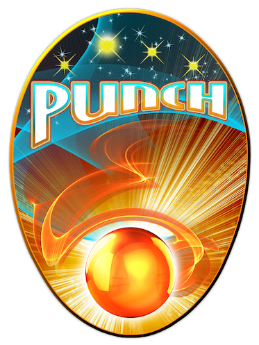
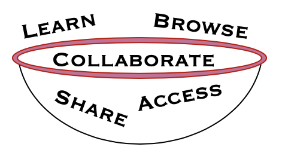

# punch-bowl

<table><tr><td></td><td><H2>Welcome to the PUNCH Bowl!</h2></td><td></table>

The PUNCH Bowl is your online, interactive User Guide to:
browse PUNCH data,
download data products,
access analysis tools, software and methods, and
learn how to use PUNCH data to maximize your science return.
The PUNCH Bowl is your access point for PUNCH Recipes: all of the tools, code and routines that optimize the use of PUNCH data and streamline your access. 
The PUNCH Bowl is maintained and supported by the PUNCH science team, but we welcome and rely on contributions from our users to ensure that everyone is able to easily access all available tools and methods.
PUNCH User Guide

• PUNCH Instrument Description(s)

things about orbit, how instrument operates, how data are collected and sampled.
• PUNCH Data Products
Browse Products (how to just take a look and get an idea of what’s going on)
Quicklook/Level 0/1 (raw data or slightly processed data)
Higher levels: Advanced/Derived Products (advanced products that we anticipate most people using
Data Keywords and Metadata (Where is the information that is needed to analyze the data? What’s in the header? What are things called? Is there additional Metadata that one might need? ) • How to Access PUNCH Data
Data Query (what’s there?)
Retrieving Data • PUNCH Analysis Software & Tools
How to manipulate PUNCH data products
Common things people would do with a data product
lots of examples & recipes • PUNCH Calibration
vital information to help the user understand what’s been done to the data and the limitations of the data • PUNCH Data Policy
• Contact
In [4]:
1492/4
Out[4]:
373.0
In [ ]:
